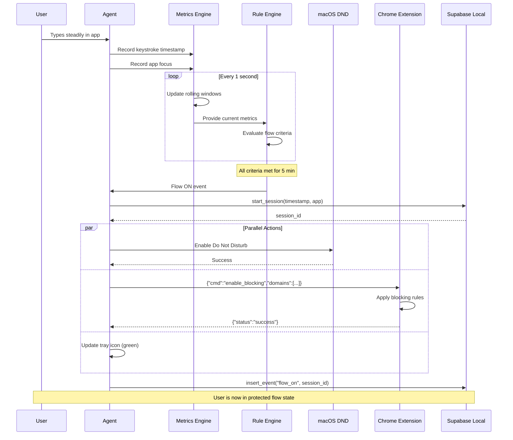
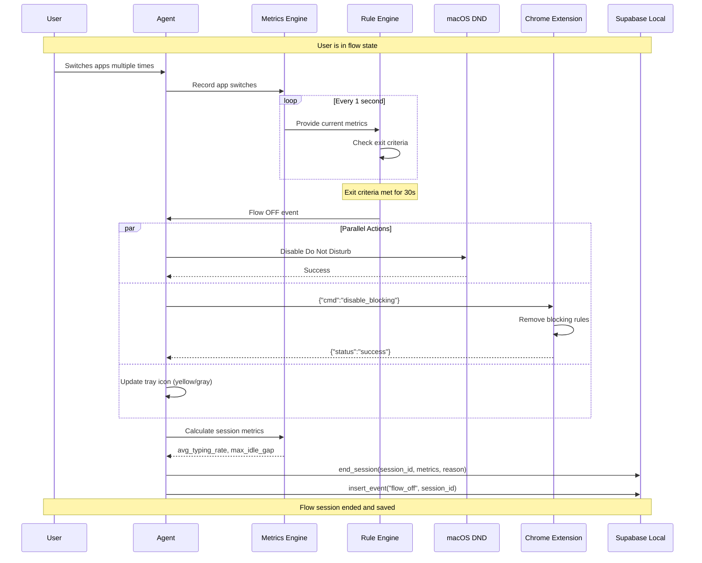
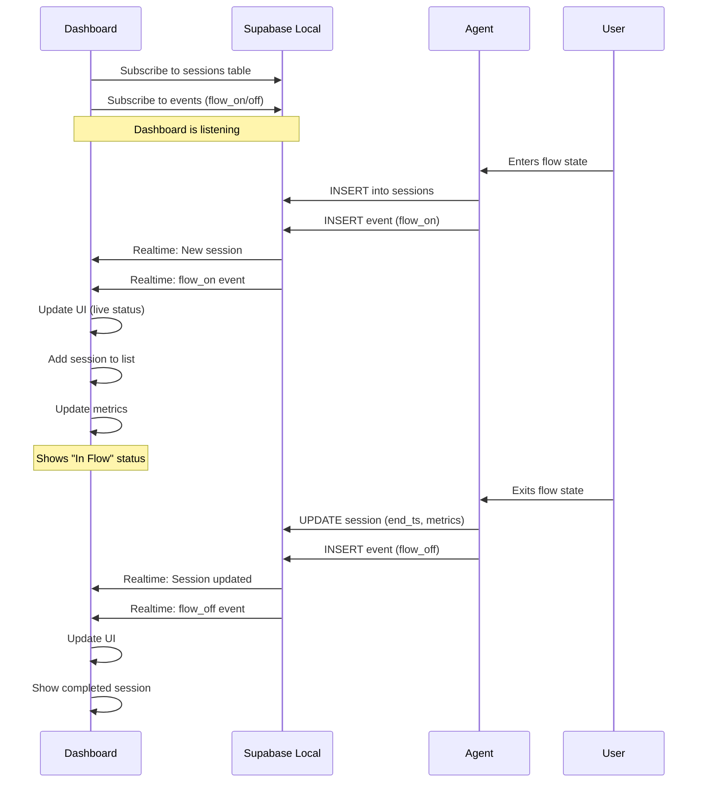
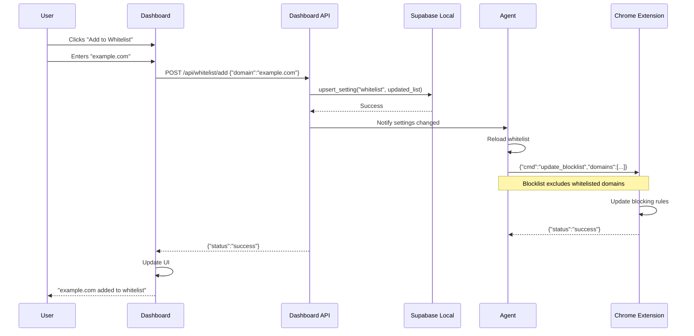
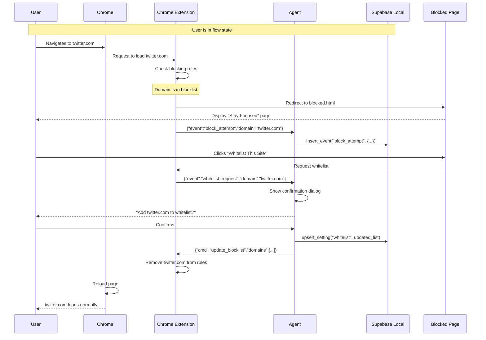
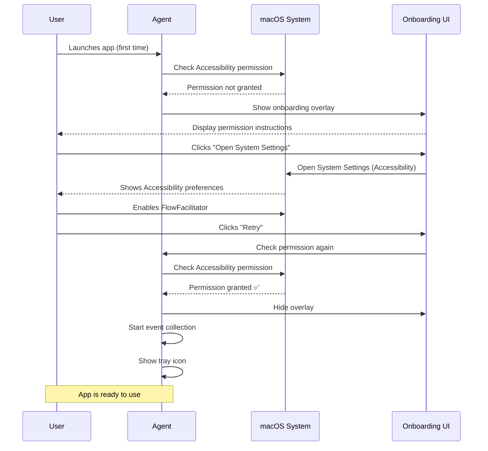
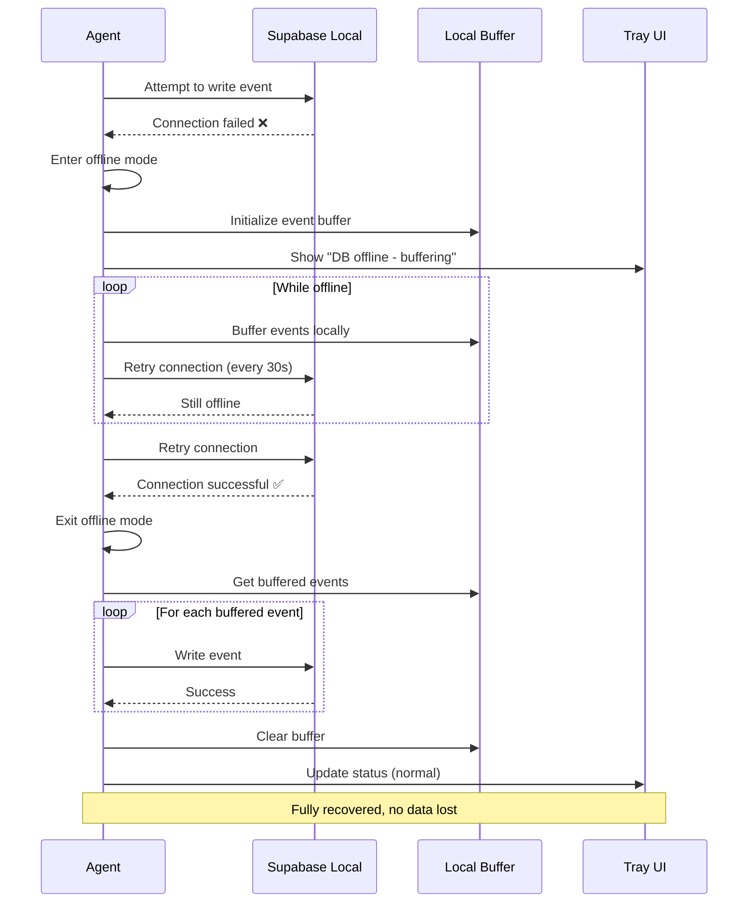
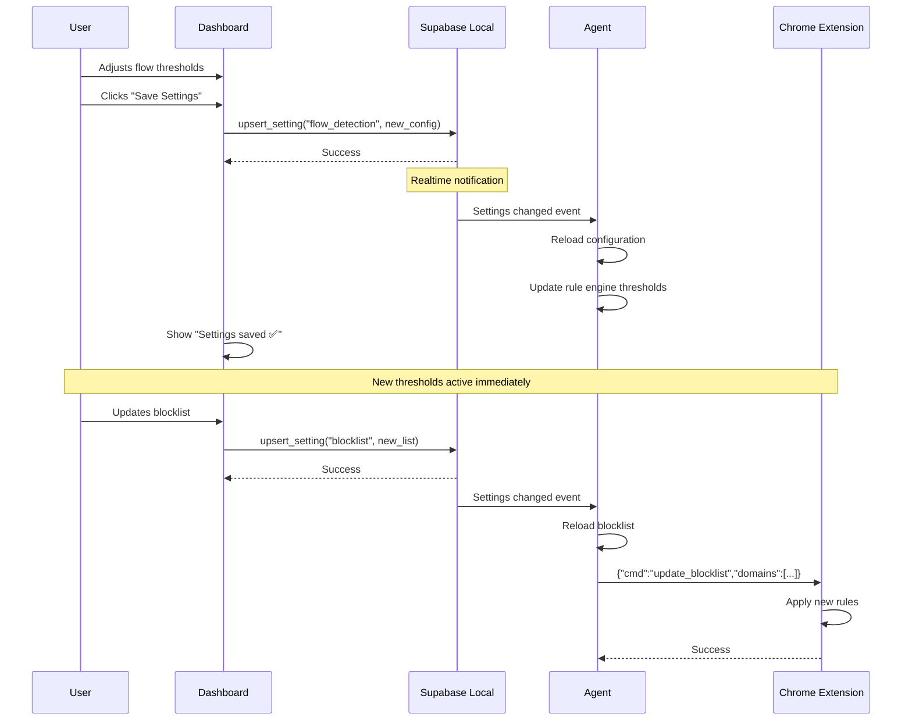

# System Architecture - Sequence Diagrams

## Overview
This document contains sequence diagrams illustrating the key interactions between components of the FlowFacilitator system.

## 1. Flow Entry Sequence



## 2. Flow Exit Sequence



## 3. Dashboard Real-time Update



## 4. User Whitelist Addition



## 5. Extension Block Attempt



## 6. Permission Request Flow



## 7. Database Offline Recovery



## 8. Settings Update Propagation



## Component Interaction Summary

### Key Communication Patterns

1. **Agent ↔ Supabase**: Direct database operations via client SDK
2. **Agent ↔ Extension**: Native Messaging (JSON over stdio)
3. **Dashboard ↔ Supabase**: Direct queries + Realtime subscriptions
4. **Dashboard ↔ Agent**: REST API (local HTTP)
5. **Agent ↔ macOS**: System APIs (DND, Accessibility)

### Data Flow

```
User Input → Agent → Metrics Engine → Rule Engine → Protection Actions
                ↓                                          ↓
            Supabase ← ← ← ← ← ← ← ← ← ← ← ← ← ← ← ← ← ←
                ↓
            Dashboard (Realtime)
```

### Error Handling Pattern

All components follow:
1. Attempt operation
2. If fails, log error
3. Show user-friendly message
4. Implement fallback or retry
5. Never crash the app
